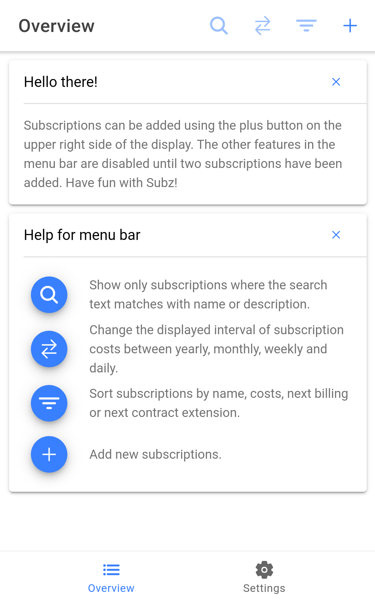
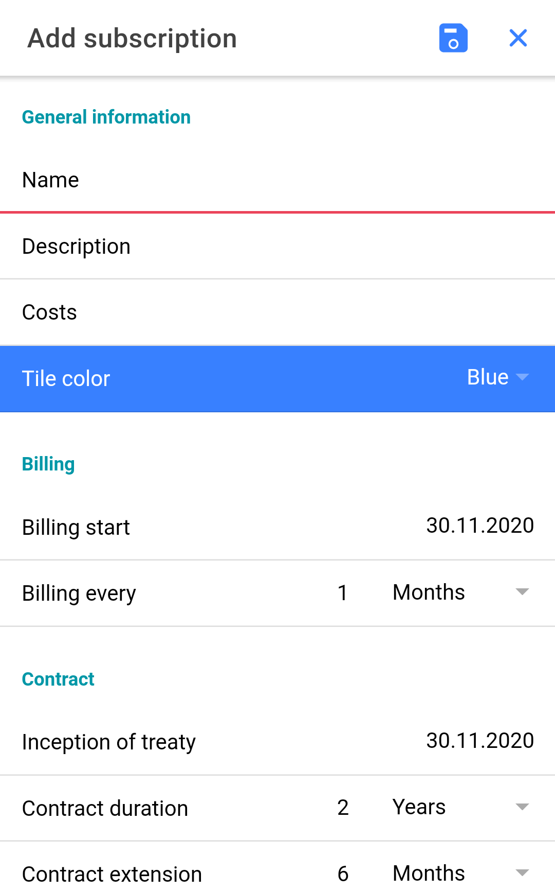

# Subz

Subscription and contract management app for Android based on Ionic and Angular. Written in TypeScript.

<a href="https://hosted.weblate.org/engage/subz/">
  
</a>

<p align="center">
  <a href="https://epinez.codeberg.page/projects/subz/index.html"></a>
  <a href="https://f-droid.org/packages/com.flasskamp.subz"></a>
</p>

<p align="center">
  
  
  
  
</p>

## Features

The app is quite minimal but offers the most important features.

### Functional

- Add subscriptions and details like costs, billing interval, contract durations and cancelation period
- Show all subscriptions and their costs
- Show days until next billing
- Switch subscription cost overview to daily, weekly, monthly and yearly
- Modify and delete subscriptions
- Search for specific subscriptions
- Sort subscriptions by name, costs, etc.
- Optional reminder for reaching cancelation period of subscriptions

### Settings

- Dark-mode
- Global currency selection
- Local backup and restore

## Building

### Prerequisites

- Node: Install the packages `nodejs` and `npm` or get it from: https://nodejs.org
- Git: Install the `git` package or get it from: https://git-scm.com/download
- Ionic: `[sudo] npm install -g @ionic/cli`
- Android Studio / SDK: Get it from: https://developer.android.com/studio

### Build the app

```
git clone https://codeberg.org/epinez/Subz.git
cd Subz
npm i
ionic build --prod
npx cap sync
npx cap open android
```

Now you can run a build within Android Studio. You could also run it in a browser with `ionic serve`. Enjoy!

## Contributing

Feel free to help me improving Subz in any possible way! These are some examples of how you could help:

- **File an issue**: Did you notice a bug while using Subz or do you have some ideas of how we could enhance it? [File an issue](https://codeberg.org/epinez/Subz/issues) and I will notice it!
- **Tell others about Subz**: I wanted to create something which not only helps me but also others. Everybody knows the struggle of forgetting to cancel a contract in time. I want that to be a problem of the past, so please help me to help others and tell them about Subz!
- **Translate**: Subz is not localized in your language? You are welcome to add it! Of course, you are also very welcome to improve the current translation. Localization is handled on [Weblate](https://hosted.weblate.org/projects/subz/subz).
- **Start coding**: Are you familiar with Typescript, HTML, SCSS, Angular or Ionic? You are more than welcome to contribute to the code! Please file issues first and reference to them in the commit like `Fixes bad behaviour xy, closes #1`. If you want to contribute new features please wait for my response because I want to keep the app as clean and straightforward as possible. :-) Of course you could also update the documentation, etc.

## Thanks to

- [mondstern](https://codeberg.org/mondstern) for his beautiful acrylic painting of the Subz logo
- [kingu](https://codeberg.org/kingu) for norwegian translation