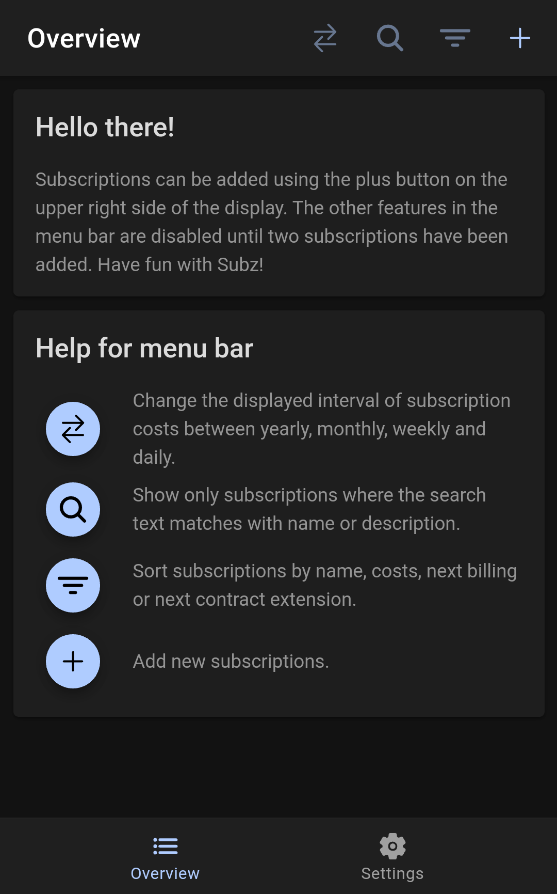
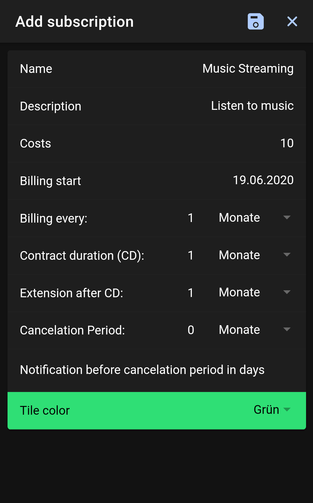
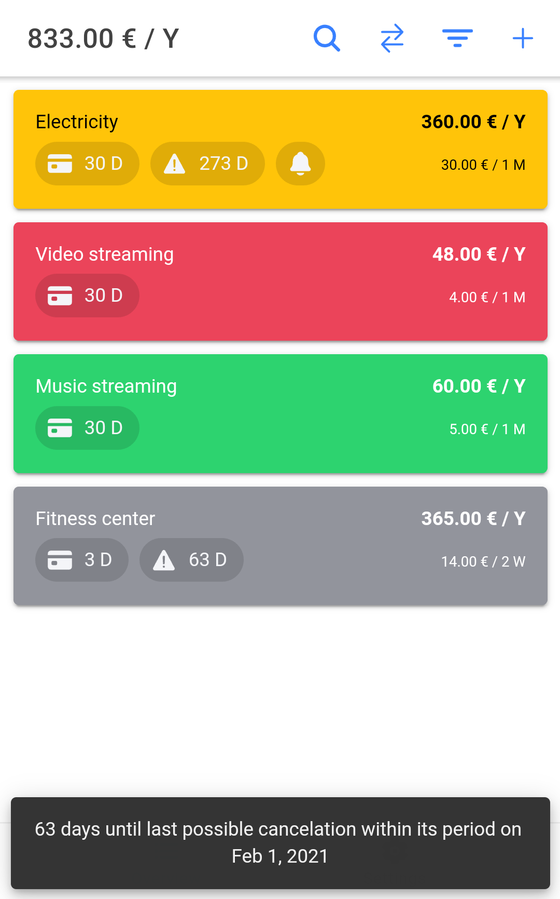
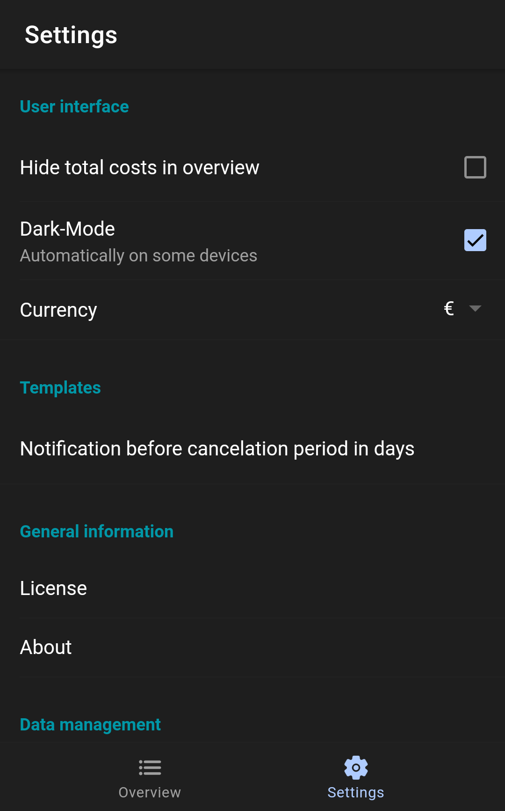

# Subz

Subscription and contract management app for Android based on Ionic.

<p float="left">
  
  
  
  
</p>

## Features

The app is quite minimal but offers the most important features.

### Functional

- Add subscriptions and details like costs, billing interval, contract durations and cancelation period
- Show all subscriptions and their costs
- Show days until next billing
- Switch subscription cost overview to daily, weekly, monthly and yearly
- Modify and delete subscriptions
- Search for specific subscriptions
- Sort subscriptions by name, costs, etc.
- Optional reminder for reaching cancelation period of subscriptions (tbd)

### Settings

- Dark-mode
- Global currency selection
- Local backup and restore

### Others

- Localization (English, German so far)

## Building

```
git pull https://codeberg.org/epinez/Subz.git
cd Subz
npm i
ionic capacitor build android --prod
```

Then open the Android Studio project under `android/` and run a build. You could also run it in a browser with `ionic serve`. Enjoy!

## Contributing

Feel free to help me improving Subz in any possible way!